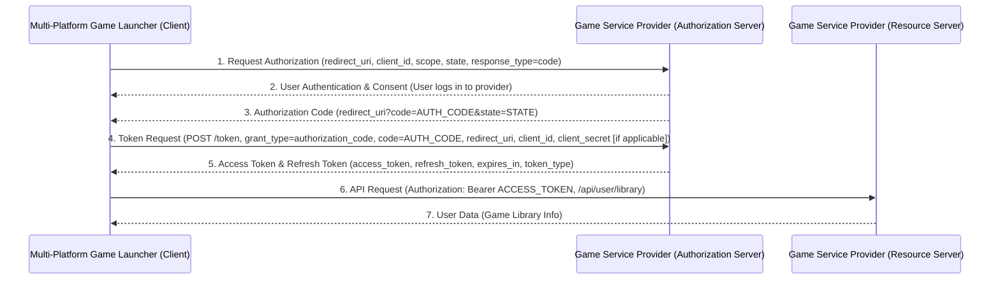

# Authentication Flows

This document outlines the OAuth 2.0 and OpenID Connect (OIDC) authentication flows used by the Multi-Platform Game Launcher.

## Table of Contents

1.  [Introduction](#introduction)
2.  [OAuth 2.0 Authorization Code Flow](#oauth-20-authorization-code-flow)
    *   [Flow Diagram](#flow-diagram)
    *   [Steps](#steps)
    *   [Client-Side Implementation](#client-side-implementation)
    *   [Server-Side Implementation](#server-side-implementation)
3.  [OpenID Connect (OIDC) Flow](#openid-connect-oidc-flow)
    *   [Flow Diagram](#flow-diagram-1)
    *   [Steps](#steps-1)
    *   [Key Differences from OAuth 2.0](#key-differences-from-oauth-20)
4.  [Token Management](#token-management)
    *   [Access Tokens](#access-tokens)
    *   [Refresh Tokens](#refresh-tokens)
    *   [ID Tokens (OIDC)](#id-tokens-oidc)
5.  [Security Considerations](#security-considerations)
    *   [PKCE](#pkce)
    *   [State Parameter](#state-parameter)
    *   [HTTPS](#https)
    *   [Client Secrets](#client-secrets)
    *   [Token Storage](#token-storage)
6.  [Provider-Specific Notes](#provider-specific-notes)
    *   [Steam](#steam)
    *   [Epic Games](#epic-games)
    *   [GOG](#gog)
    *   [Xbox Game Pass](#xbox-game-pass)
    *   [Ubisoft+](#ubisoft)

---

## 1. Introduction

The Multi-Platform Game Launcher requires authentication with various game service providers (Steam, Epic Games, GOG, Xbox Game Pass, Ubisoft+) to manage user libraries and game data. We utilize industry-standard protocols, OAuth 2.0 and OpenID Connect (OIDC), to handle these authentication processes securely and efficiently.

OAuth 2.0 is an authorization framework that enables applications to obtain limited access to user accounts on an HTTP service. OpenID Connect is an identity layer built on top of the OAuth 2.0 framework, allowing clients to verify the identity of the end-user based on the authentication performed by an authorization server, as well as to obtain basic profile information about the end-user.

## 2. OAuth 2.0 Authorization Code Flow

The Authorization Code Flow is the most common and recommended OAuth 2.0 flow for web applications and native applications (like our Electron client). It involves exchanging an authorization code for an access token.

### Flow Diagram



### Steps

1.  **Authorization Request:** The client application initiates the flow by redirecting the user's browser to the authorization server's authorization endpoint. This request includes parameters like `client_id`, `redirect_uri`, `scope` (permissions requested), `state` (for CSRF protection), and `response_type=code`.
2.  **User Authentication & Consent:** The authorization server authenticates the user (e.g., prompts for username/password) and asks for their consent to grant the requested permissions (`scope`) to the client application.
3.  **Authorization Code Grant:** If the user grants consent, the authorization server redirects the user's browser back to the `redirect_uri` specified by the client. This redirect includes a short-lived, single-use `authorization_code` and the original `state` parameter.
4.  **Token Request:** The client application receives the authorization code. It then makes a *direct, back-channel* request (server-to-server) to the authorization server's token endpoint. This request includes the `authorization_code`, `redirect_uri`, `client_id`, `grant_type=authorization_code`, and optionally the `client_secret`.
5.  **Token Response:** The authorization server validates the authorization code and the client credentials. If valid, it issues an `access_token`, a `refresh_token` (if requested and supported), and other relevant information like `expires_in` and `token_type`.
6.  **API Request:** The client application uses the `access_token` to make authenticated requests to the resource server (the API of the game service provider) on behalf of the user. This is typically done by including the token in the `Authorization` header as a Bearer token.
7.  **Resource Access:** The resource server validates the `access_token` and, if valid, returns the requested user data.

### Client-Side Implementation (Electron/React)

The client-side (Electron app using React/TypeScript) handles the initial redirect and the subsequent handling of the authorization code.

*   **Initiating the Flow:** When a user clicks "Connect [Provider]", the client constructs the authorization URL and opens it in the system's default browser or an in-app browser window.
    ```typescript
    // Example in React component
    const handleConnectProvider = (provider: string) => {
        const clientId = process.env.REACT_APP_CLIENT_ID; // Or fetched from config
        const redirectUri = process.env.REACT_APP_REDIRECT_URI;
        const scope = getProviderScope(provider); // e.g., 'read_library'
        const state = generateRandomString(32); // For CSRF protection

        // Store state locally (e.g., localStorage or IPC state)
        localStorage.setItem(`oauth_state_${provider}`, state);

        const authUrl = `https://provider.auth.com/authorize?response_type=code&client_id=${clientId}&redirect_uri=${encodeURIComponent(redirectUri)}&scope=${encodeURIComponent(scope)}&state=${state}`;

        // Use Electron's shell.openExternal or a webview/browser window
        window.electron.openExternal(authUrl);
    };
    ```
*   **Handling the Redirect:** The `redirect_uri` is typically a custom URL scheme (e.g., `myapp://callback/steam`) or a local HTTP server endpoint if using a webview. The client needs to listen for these redirects.
    *   **Custom URL Scheme (Electron):**
        ```typescript
        // In main process (electron/main.js)
        import { app, protocol, shell } from 'electron';
        import path from 'path';

        // Register custom protocol
        protocol.registerSchemesAsPrivileged([
          { scheme: 'myapp', privileges: { standard: true, supportFetch: true } }
        ]);

        app.on('ready', () => {
          // ... other setup
          protocol.handle('myapp', (request) => {
            const url = new URL(request.url);
            const pathname = url.pathname; // e.g., '/callback/steam'
            const queryParams = Object.fromEntries(url.searchParams);

            if (pathname === '/callback/steam') {
              const { code, state } = queryParams;
              const storedState = localStorage.getItem('oauth_state_steam'); // Needs IPC to access renderer state

              if (state === storedState && code) {
                // Send code and state to renderer process via IPC
                mainWindow.webContents.send('oauth-callback', { provider: 'steam', code, state });
              } else {
                // Handle error: state mismatch or missing code
                mainWindow.webContents.send('oauth-error', { provider: 'steam', message: 'Invalid state or missing code.' });
              }
            }
            // ... handle other providers
            return new Response('Authentication successful. You can close this window.', {
              headers: { 'Content-Type': 'text/html' }
            });
          });
        });

        // In renderer process (preload.ts)
        import { contextBridge, ipcRenderer } from 'electron';

        contextBridge.exposeInMainWorld('electronAPI', {
          openExternal: (url: string) => ipcRenderer.invoke('open-external', url),
          onOauthCallback: (callback: (data: { provider: string; code: string; state: string }) => void) =>
            ipcRenderer.on('oauth-callback', (_, data) => callback(data)),
          onOauthError: (callback: (data: { provider: string; message: string }) => void) =>
            ipcRenderer.on('oauth-error', (_, data) => callback(data)),
        });

        // In renderer process (React component)
        useEffect(() => {
          const handleCallback = (data) => {
            console.log('Received callback:', data);
            // Send code to backend for token exchange
            sendCodeToBackend(data.provider, data.code, data.state);
          };
          const handleError = (data) => {
            console.error('OAuth Error:', data);
            // Show error message to user
          };

          window.electronAPI.onOauthCallback(handleCallback);
          window.electronAPI.onOauthError(handleError);

          return () => {
            // Clean up listeners if necessary
          };
        }, []);
        ```
    *   **Local HTTP Server (Alternative for Webviews):** A small HTTP server could run locally (e.g., on port 3000) and listen for the redirect. The server would then communicate the code back to the main Electron process.

### Server-Side Implementation (FastAPI Backend)

The backend is responsible for securely exchanging the authorization code for tokens and storing them.

*   **Environment Variables:** Store `CLIENT_ID`, `CLIENT_SECRET`, and `REDIRECT_URI` for each provider.
    ```dotenv
    # .env
    STEAM_CLIENT_ID=your_steam_client_id
    STEAM_CLIENT_SECRET=your_steam_client_secret
    STEAM_REDIRECT_URI=http://localhost:8000/auth/callback/steam

    EPIC_CLIENT_ID=your_epic_client_id
    EPIC_CLIENT_SECRET=your_epic_client_secret
    EPIC_REDIRECT_URI=http://localhost:8000/auth/callback/epic
    # ... other providers
    ```
*   **Token Exchange Endpoint:** An endpoint to receive the authorization code from the client.
    ```python
    # main.py (FastAPI application)
    import os
    import httpx
    from fastapi import FastAPI, HTTPException, Depends, Request
    from pydantic import BaseModel
    from dotenv import load_dotenv
    from sqlalchemy.orm import Session
    import logging

    from database import SessionLocal, get_db # Assuming you have database setup
    from models import UserProviderAuth # Assuming you have SQLAlchemy models

    load_dotenv()

    logging.basicConfig(level=logging.INFO)
    logger = logging.getLogger(__name__)

    app = FastAPI()

    # --- Configuration ---
    PROVIDER_CONFIG = {
        "steam": {
            "auth_url": "https://steamcommunity.com/openid/login", # Example, actual might differ
            "token_url": "https://api.steampowered.com/ISteamUserOAuth/GetToken/v1/", # Example
            "client_id": os.getenv("STEAM_CLIENT_ID"),
            "client_secret": os.getenv("STEAM_CLIENT_SECRET"),
            "redirect_uri": os.getenv("STEAM_REDIRECT_URI"),
            "scopes": ["read_profile", "read_library"], # Example scopes
        },
        "epic": {
            "auth_url": "https://www.epicgames.com/id/oauth2/authorize",
            "token_url": "https://api.epicgames.dev/epic/auth/v1/oauth/token",
            "client_id": os.getenv("EPIC_CLIENT_ID"),
            "client_secret": os.getenv("EPIC_CLIENT_SECRET"),
            "redirect_uri": os.getenv("EPIC_REDIRECT_URI"),
            "scopes": ["basic_profile", "steam_account_id", "presence"],
        },
        # ... other providers
    }

    # --- Models ---
    class AuthCodeRequest(BaseModel):
        provider: str
        code: str
        state: str # Optional: verify against stored state if needed

    class TokenResponse(BaseModel):
        access_token: str
        refresh_token: str | None = None
        expires_in: int
        token_type: str = "Bearer"

    # --- Dependencies ---
    def get_provider_settings(provider: str):
        settings = PROVIDER_CONFIG.get(provider)
        if not settings or not settings["client_id"] or not settings["client_secret"] or not settings["redirect_uri"]:
            raise HTTPException(status_code=400, detail=f"Configuration missing for provider: {provider}")
        return settings

    # --- API Endpoints ---
    @app.post("/auth/token", response_model=TokenResponse)
    async def exchange_code_for_token(
        request: AuthCodeRequest,
        db: Session = Depends(get_db)
    ):
        provider_settings = get_provider_settings(request.provider)

        # TODO: Verify state parameter against session/stored state if implemented

        token_endpoint = provider_settings["token_url"]
        client_id = provider_settings["client_id"]
        client_secret = provider_settings["client_secret"]
        redirect_uri = provider_settings["redirect_uri"]

        # Parameters for the token request
        token_params = {
            "grant_type": "authorization_code",
            "code": request.code,
            "redirect_uri": redirect_uri,
            "client_id": client_id,
            # Client secret might be sent in headers or body depending on provider
        }

        headers = {
            "Content-Type": "application/x-www-form-urlencoded",
        }

        # Some providers require client_secret in Basic Auth header
        # Others might require it in the request body
        # Adjust based on specific provider's OAuth 2.0 spec
        auth_header_value = httpx.BasicAuth(client_id, client_secret)

        try:
            async with httpx.AsyncClient() as client:
                logger.info(f"Requesting token from {token_endpoint} for provider {request.provider}")
                response = await client.post(
                    token_endpoint,
                    data=token_params,
                    headers=headers,
                    auth=auth_header_value # Use Basic Auth here, adjust if needed
                )
                response.raise_for_status() # Raise HTTPStatusError for bad responses (4xx or 5xx)

            token_data = response.json()
            logger.info(f"Successfully received token for provider {request.provider}")

            # --- Store Tokens ---
            # Assuming you have a way to associate tokens with a user ID
            # For simplicity, we'll just return them here. In a real app,
            # you'd link these to a logged-in user session or user record.
            # Example: user_id = get_current_user_id(request)
            user_id = 1 # Placeholder

            # Store/update auth details in the database
            auth_record = db.query(UserProviderAuth).filter(
                UserProviderAuth.user_id == user_id,
                UserProviderAuth.provider == request.provider
            ).first()

            if auth_record:
                auth_record.access_token = token_data.get("access_token")
                auth_record.refresh_token = token_data.get("refresh_token")
                auth_record.expires_at = datetime.utcnow() + timedelta(seconds=token_data.get("expires_in", 3600))
                db.commit()
            else:
                new_auth = UserProviderAuth(
                    user_id=user_id,
                    provider=request.provider,
                    access_token=token_data.get("access_token"),
                    refresh_token=token_data.get("refresh_token"),
                    expires_at=datetime.utcnow() + timedelta(seconds=token_data.get("expires_in", 3600))
                )
                db.add(new_auth)
                db.commit()

            return TokenResponse(
                access_token=token_data.get("access_token"),
                refresh_token=token_data.get("refresh_token"),
                expires_in=token_data.get("expires_in"),
                token_type=token_data.get("token_type", "Bearer")
            )

        except httpx.HTTPStatusError as e:
            logger.error(f"HTTP error exchanging token for {request.provider}: {e.response.status_code} - {e.response.text}")
            raise HTTPException(status_code=e.response.status_code, detail=